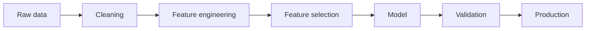

# Feature Engineering — MOC

> [!NOTE]
> Bộ ghi chú này tập trung vào cách biến dữ liệu thô thành feature có ích, tránh leakage và đưa feature vào pipeline thực tế.

## Lộ trình

1. [[01 - Basic Feature Engineering]]
2. [[02 - Feature by datatype]]
3. [[03 - Time_Series_Feature_Engineering]]
4. [[04 - Leakage - Validation - Feature Selection]]
5. [[05 - Feature Engineering in Production]]
6. [[06 - Checklist and Execrise]]

> [!TIP]
> Feature tốt phải có ý nghĩa, không dùng tương lai, tính được khi inference và ổn định trong production.
