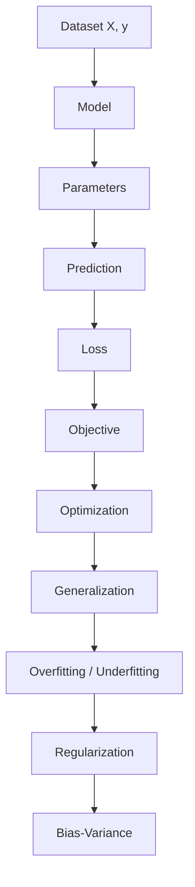

# Foundations — Additions MOC

> [!NOTE]
> Bộ note này bổ sung các khái niệm nền tảng còn thiếu và viết lại đúng phần **Parametric vs Non-parametric Models**.

## Các note

1. [[01 - Machine Learning Overview]]
2. [[02 - Types of Machine Learning]]
3. [[03 - Machine Learning Workflow]]
4. [[04 - Dataset Features and Target]]
5. [[05 - Parameters vs Hyperparameters]]
6. [[06 - Loss and Objective Function]]
7. [[07 - Generalization]]
8. [[08 - Overfitting vs Underfitting]]
9. [[09 - Bias-Variance Tradeoff]]
10. [[10 - Regularization]]
11. [[11 - Parametric vs Non-parametric Models]]
12. [[12 - Ensemble Learning]]
13. [[13 - Optimization Basics]]

