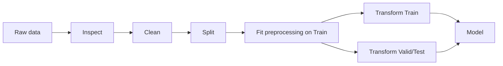

# Preprocessing — MOC

> [!abstract] Mục tiêu
> Preprocessing trả lời câu hỏi: **“Dữ liệu đã đúng, nhất quán, không leakage và ở dạng model có thể sử dụng chưa?”**

## Lộ trình
1. [[01 - Tổng quan Data Preprocessing]]
2. [[02 - Data Inspection và Cleaning]]
3. [[03 - Missing Values và Imputation]]
4. [[04 - Numerical Preprocessing]]
5. [[05 - Categorical Encoding]]
6. [[06 - Text Preprocessing]]
7. [[07 - Datetime và Time Series Preprocessing]]
8. [[08 - Outliers và Distribution Transform]]
9. [[09 - Data Leakage Pipeline và ColumnTransformer]]
10. [[10 - Preprocessing Checklist]]

> [!important] Quy tắc vàng
> Mọi bước **học tham số từ dữ liệu** như imputer, scaler, encoder vocabulary, TF-IDF IDF, PCA... đều phải `fit` chỉ trên **training data**.

## Phân biệt với Feature Engineering

| Preprocessing | Feature Engineering |
|---|---|
| Làm dữ liệu dùng được | Tạo tín hiệu mới |
| Imputation | Ratio / interaction |
| Scaling | Recency / frequency |
| Encoding | Lag / rolling |
| Text vectorization | Aggregation / domain features |
