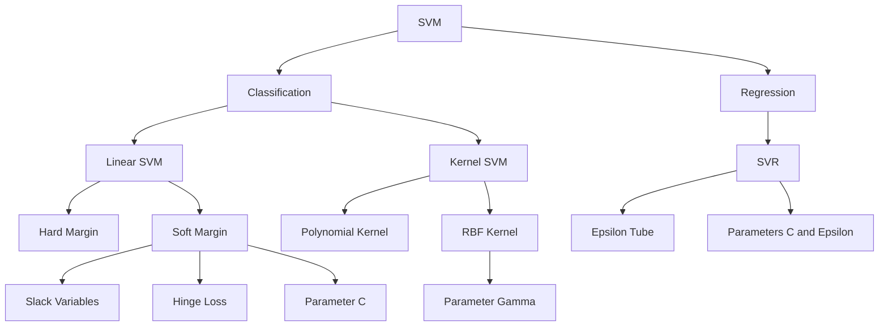

# Support Vector Machine (SVM)

> [!NOTE] Mục tiêu của ghi chú
> Tài liệu này giúp bạn hiểu **SVM hoạt động như thế nào**, thay vì chỉ học thuộc công thức.
>
> Sau khi đọc xong, bạn nên trả lời được:
> - SVM chọn ranh giới phân loại dựa trên tiêu chí nào?
> - Margin và support vector có vai trò gì?
> - Hard Margin khác Soft Margin ra sao?
> - Tham số `C` và `gamma` ảnh hưởng đến mô hình như thế nào?
> - Kernel giúp SVM xử lý dữ liệu phi tuyến bằng cách nào?
> - Khi nào nên dùng SVM, khi nào không nên dùng?
> - Cần chuẩn bị dữ liệu và đánh giá mô hình ra sao trong thực tế?

---

## 1. SVM là gì?

**Support Vector Machine (SVM)** là một họ thuật toán học có giám sát, thường được dùng cho:

- **Phân loại**: Support Vector Classification — `SVC`
- **Hồi quy**: Support Vector Regression — `SVR`

Ý tưởng cốt lõi của SVM trong bài toán phân loại là:

> [!NOTE]
> Tìm một ranh giới phân loại không chỉ phân chia dữ liệu tốt, mà còn tạo ra **khoảng cách an toàn lớn nhất** giữa ranh giới và những điểm dữ liệu gần nó nhất.

Ranh giới này được gọi là **decision boundary** hoặc **hyperplane**.

---

## 2. Trực giác: Tại sao không chọn một đường bất kỳ?

Giả sử ta có hai lớp dữ liệu có thể được phân tách bằng nhiều đường thẳng khác nhau.

Một số đường có thể phân loại đúng toàn bộ dữ liệu huấn luyện, nhưng lại nằm rất sát một trong hai lớp. Khi xuất hiện dữ liệu mới, chỉ cần thay đổi nhỏ cũng có thể khiến dự đoán sai.

SVM ưu tiên đường phân chia có khoảng cách đến các điểm gần nhất của hai lớp là lớn nhất.

> [!NOTE] Gợi ý hình minh họa
> Chèn hình từ **PDF trang 13–18**:
> - Trang 13–14: nhiều đường đều có thể phân chia hai lớp.
> - Trang 17: so sánh ranh giới có khoảng cách nhỏ và lớn.
> - Trang 18: ý tưởng tối đa hóa khoảng cách đến các điểm gần nhất.

### Ý nghĩa thực tế

Ranh giới có margin lớn thường:

- Ít nhạy cảm hơn với nhiễu nhỏ
- Có khả năng tổng quát hóa tốt hơn
- Giảm nguy cơ mô hình chỉ học thuộc dữ liệu huấn luyện

---

## 3. Decision Boundary và hàm quyết định

Với đầu vào:

\[
\mathbf{x} =
\begin{bmatrix}
x_1 \\
x_2 \\
\vdots \\
x_d
\end{bmatrix}
\]

SVM tuyến tính xây dựng hàm:

\[
f(\mathbf{x}) = \mathbf{w}^{T}\mathbf{x} + b
\]

Trong đó:

- \(\mathbf{w}\): vector trọng số, quyết định hướng của ranh giới
- \(b\): hệ số dịch chuyển ranh giới
- \(f(\mathbf{x})\): giá trị quyết định

Decision boundary là tập hợp các điểm thỏa mãn:

\[
\mathbf{w}^{T}\mathbf{x} + b = 0
\]

Dự đoán nhãn:

\[
\hat{y} =
\operatorname{sign}\left(\mathbf{w}^{T}\mathbf{x}+b\right)
\]

Cụ thể:

\[
\hat{y} =
\begin{cases}
+1, & \mathbf{w}^{T}\mathbf{x}+b > 0 \\
-1, & \mathbf{w}^{T}\mathbf{x}+b < 0
\end{cases}
\]

> [!IMPORTANT]
> Không nên hiểu SVM theo quy tắc “điểm nằm bên trái hay bên phải”.
>
> Quy tắc tổng quát là xét **dấu của hàm quyết định** \(f(\mathbf{x})\). Bên nào mang nhãn \(+1\) hoặc \(-1\) phụ thuộc vào hướng của \(\mathbf{w}\).

---

## 4. Hyperplane thay đổi theo số chiều

| Không gian dữ liệu | Ranh giới phân loại |
|---|---|
| 1 chiều | Một điểm |
| 2 chiều | Một đường thẳng |
| 3 chiều | Một mặt phẳng |
| \(d\) chiều | Một siêu phẳng |

Trong không gian \(d\) chiều, hyperplane có số chiều là \(d-1\).

Ví dụ:

- Dữ liệu có 2 đặc trưng → ranh giới là đường thẳng
- Dữ liệu có 3 đặc trưng → ranh giới là mặt phẳng
- Dữ liệu có 100 đặc trưng → ranh giới là hyperplane 99 chiều

---

## 5. Margin là gì?

SVM sử dụng ba hyperplane song song:

\[
\mathbf{w}^{T}\mathbf{x} + b = 1
\]

\[
\mathbf{w}^{T}\mathbf{x} + b = 0
\]

\[
\mathbf{w}^{T}\mathbf{x} + b = -1
\]

Trong đó:

- \(\mathbf{w}^{T}\mathbf{x}+b=0\): decision boundary
- Hai đường còn lại: biên của margin

Khoảng cách từ decision boundary đến mỗi đường biên là:

\[
\frac{1}{\|\mathbf{w}\|}
\]

Chiều rộng toàn bộ margin là:

\[
\frac{2}{\|\mathbf{w}\|}
\]

Do đó:

\[
\text{Tối đa hóa margin}
\quad \Longleftrightarrow \quad
\text{Tối thiểu hóa } \|\mathbf{w}\|
\]

Trong thực tế, ta thường tối thiểu hóa biểu thức tương đương và thuận tiện hơn:

\[
\frac{1}{2}\|\mathbf{w}\|^2
\]

> [!NOTE] Gợi ý hình minh họa
> Chèn hình từ **PDF trang 19–20 hoặc trang 33–34** để thể hiện:
> - Decision boundary
> - Hai đường margin
> - Khoảng cách \(1/\|\mathbf{w}\|\)
> - Tổng chiều rộng \(2/\|\mathbf{w}\|\)

---

## 6. Support Vectors là gì?

**Support vectors** là những điểm nằm:

- Trên đường biên margin
- Bên trong margin
- Hoặc bị phân loại sai trong Soft Margin SVM

Đây là những điểm nằm gần decision boundary nhất và có ảnh hưởng trực tiếp đến vị trí của ranh giới.

> [!NOTE]
> SVM không cần mọi điểm dữ liệu để quyết định ranh giới.  
> Ranh giới chủ yếu được xác định bởi các **support vectors**.

### Tại sao gọi là “support”?

Vì các điểm này “đỡ” hoặc “neo giữ” decision boundary.

Nếu di chuyển một điểm ở rất xa margin, ranh giới thường gần như không đổi.

Nếu di chuyển một support vector, ranh giới có thể thay đổi rõ rệt.

> [!NOTE] Gợi ý hình minh họa
> Chèn hình từ **PDF trang 25–26** để đánh dấu:
> - Các điểm trên margin
> - Các điểm nằm bên trong margin
> - Support vectors

---

# 7. Hard Margin SVM

## 7.1. Ý tưởng

Hard Margin SVM yêu cầu:

- Dữ liệu phải phân tách tuyến tính hoàn toàn
- Không điểm nào được nằm trong margin
- Không điểm nào được phân loại sai

Với nhãn:

\[
y_i \in \{-1,+1\}
\]

điều kiện cho mọi điểm dữ liệu là:

\[
y_i\left(\mathbf{w}^{T}\mathbf{x}_i+b\right)\ge 1
\]

Bài toán tối ưu:

\[
\min_{\mathbf{w},b}
\frac{1}{2}\|\mathbf{w}\|^2
\]

với ràng buộc:

\[
y_i\left(\mathbf{w}^{T}\mathbf{x}_i+b\right)\ge 1,
\qquad i=1,\dots,n
\]

## 7.2. Hiểu ràng buộc

Nếu \(y_i=+1\):

\[
\mathbf{w}^{T}\mathbf{x}_i+b \ge 1
\]

Nếu \(y_i=-1\):

\[
\mathbf{w}^{T}\mathbf{x}_i+b \le -1
\]

Hai trường hợp được gộp thành:

\[
y_i\left(\mathbf{w}^{T}\mathbf{x}_i+b\right)\ge 1
\]

## 7.3. Hạn chế

Hard Margin SVM rất nhạy cảm với:

- Outlier
- Nhiễu
- Điểm gán nhãn sai
- Dữ liệu hai lớp chồng lấn

Chỉ một outlier cũng có thể khiến decision boundary thay đổi mạnh và margin bị thu hẹp.

> [!NOTE] Gợi ý hình minh họa
> Chèn hình từ **PDF trang 21** để minh họa outlier khiến Hard Margin tạo ra ranh giới kém.

> [!WARNING]
> Hard Margin SVM chủ yếu có giá trị để hiểu lý thuyết.  
> Trong dữ liệu thực tế, Soft Margin SVM thường phù hợp hơn.

---

# 8. Soft Margin SVM

## 8.1. Tại sao cần Soft Margin?

Dữ liệu thực tế hiếm khi phân tách hoàn hảo.

Soft Margin SVM cho phép:

- Một số điểm nằm trong margin
- Một số điểm nằm sai phía của decision boundary
- Đổi lại mô hình có thể tạo margin rộng hơn và tổng quát hóa tốt hơn

Đây là sự đánh đổi giữa:

- **Margin rộng**
- **Sai số huấn luyện thấp**

## 8.2. Slack Variable

Ta thêm biến:

\[
\xi_i \ge 0
\]

Ràng buộc trở thành:

\[
y_i\left(\mathbf{w}^{T}\mathbf{x}_i+b\right)\ge 1-\xi_i
\]

Ý nghĩa của \(\xi_i\):

| Giá trị | Diễn giải |
|---|---|
| \(\xi_i=0\) | Điểm được phân loại đúng và nằm ngoài hoặc trên margin |
| \(0<\xi_i<1\) | Điểm nằm trong margin nhưng vẫn đúng lớp |
| \(\xi_i=1\) | Điểm nằm trên decision boundary |
| \(\xi_i>1\) | Điểm bị phân loại sai |

## 8.3. Bài toán tối ưu

\[
\min_{\mathbf{w},b,\boldsymbol{\xi}}
\frac{1}{2}\|\mathbf{w}\|^2
+
C\sum_{i=1}^{n}\xi_i
\]

với:

\[
y_i\left(\mathbf{w}^{T}\mathbf{x}_i+b\right)
\ge 1-\xi_i
\]

\[
\xi_i\ge 0
\]

Hai phần của hàm mục tiêu:

\[
\underbrace{\frac{1}{2}\|\mathbf{w}\|^2}_{\text{khuyến khích margin rộng}}
+
\underbrace{C\sum_{i=1}^{n}\xi_i}_{\text{phạt vi phạm}}
\]

> [!NOTE] Gợi ý hình minh họa
> Chèn hình từ **PDF trang 22–26 và trang 36**:
> - Cho phép điểm vi phạm margin
> - Minh họa điểm bị phân loại sai
> - Công thức Soft Margin SVM

---

# 9. Hinge Loss

Soft Margin SVM cũng có thể được viết bằng **hinge loss**:

\[
\mathcal{L}_{\text{hinge}}
=
\max\left(0,\,
1-y_i f(\mathbf{x}_i)
\right)
\]

với:

\[
f(\mathbf{x}_i)=\mathbf{w}^{T}\mathbf{x}_i+b
\]

Hàm mục tiêu:

\[
\min_{\mathbf{w},b}
\frac{1}{2}\|\mathbf{w}\|^2
+
C\sum_{i=1}^{n}
\max\left(
0,\,
1-y_i(\mathbf{w}^{T}\mathbf{x}_i+b)
\right)
\]

## Cách hinge loss hoạt động

### Trường hợp 1: Điểm nằm ngoài margin và đúng lớp

\[
y_i f(\mathbf{x}_i)\ge1
\]

\[
\mathcal{L}_{\text{hinge}}=0
\]

### Trường hợp 2: Điểm đúng lớp nhưng nằm trong margin

\[
0<y_i f(\mathbf{x}_i)<1
\]

Loss dương vì điểm chưa đủ “an toàn”.

### Trường hợp 3: Điểm bị phân loại sai

\[
y_i f(\mathbf{x}_i)<0
\]

Loss lớn hơn 1.

> [!TIP]
> Hinge loss không chỉ yêu cầu dự đoán đúng.  
> Nó còn yêu cầu điểm được dự đoán đúng với **khoảng cách đủ an toàn** khỏi decision boundary.

---

# 10. Tham số \(C\)

\(C\) điều khiển mức phạt cho các điểm vi phạm margin hoặc bị phân loại sai.

## \(C\) lớn

- Phạt lỗi mạnh
- Cố gắng phân loại đúng dữ liệu huấn luyện
- Margin thường hẹp hơn
- Mô hình phức tạp và nhạy với outlier hơn
- Nguy cơ overfitting cao hơn

## \(C\) nhỏ

- Chấp nhận nhiều vi phạm hơn
- Margin thường rộng hơn
- Regularization mạnh hơn
- Có thể tăng bias
- Thường ổn định hơn với nhiễu

| Giá trị \(C\) | Hành vi |
|---|---|
| Nhỏ | Margin rộng, chấp nhận lỗi |
| Lớn | Margin hẹp, cố gắng giảm lỗi train |

> [!IMPORTANT]
> Không có giá trị \(C\) tốt nhất cho mọi bài toán.  
> Cần lựa chọn bằng validation hoặc cross-validation.

---

# 11. Khi dữ liệu không phân tách tuyến tính

Không phải dữ liệu nào cũng có thể được chia bằng một đường thẳng hoặc hyperplane tuyến tính.

Ví dụ:

- Một lớp nằm ở giữa, lớp còn lại nằm hai bên
- Hai lớp tạo thành các vòng tròn đồng tâm
- Dữ liệu có ranh giới cong hoặc phức tạp

Một cách giải quyết là ánh xạ dữ liệu:

\[
\mathbf{x}
\longrightarrow
\phi(\mathbf{x})
\]

sang một không gian đặc trưng có số chiều cao hơn, nơi dữ liệu có thể trở nên phân tách tuyến tính.

Ví dụ trong 1D:

\[
x \longrightarrow
\phi(x)=
\begin{bmatrix}
x \\
x^2
\end{bmatrix}
\]

Trong không gian mới, dữ liệu có thể được phân tách bằng một đường thẳng.

> [!NOTE] Gợi ý hình minh họa
> Chèn hình từ **PDF phần dữ liệu phi tuyến và kernel, khoảng trang 37–46**:
> - Dữ liệu không phân tách được trong không gian gốc
> - Ánh xạ lên không gian chiều cao
> - Phân tách tuyến tính trong không gian mới

---

# 12. Kernel Trick

## 12.1. Vấn đề của phép biến đổi trực tiếp

Giả sử ta ánh xạ:

\[
\phi(\mathbf{x})
\]

sang không gian có hàng nghìn, hàng triệu hoặc vô hạn chiều.

Việc tính trực tiếp tất cả tọa độ mới có thể rất tốn kém hoặc không khả thi.

## 12.2. Ý tưởng Kernel Trick

Trong công thức SVM dạng đối ngẫu, dữ liệu thường xuất hiện thông qua tích vô hướng:

\[
\phi(\mathbf{x}_i)^T\phi(\mathbf{x}_j)
\]

Kernel trick sử dụng một hàm:

\[
K(\mathbf{x}_i,\mathbf{x}_j)
=
\phi(\mathbf{x}_i)^T\phi(\mathbf{x}_j)
\]

Nhờ đó, ta tính tích vô hướng trong không gian chiều cao mà không cần tạo trực tiếp các vector \(\phi(\mathbf{x})\).

> [!NOTE]
> Kernel không nhất thiết “di chuyển dữ liệu” theo nghĩa tính toàn bộ tọa độ mới.
>
> Nó cho phép mô hình làm việc như thể dữ liệu đã được ánh xạ lên không gian chiều cao bằng cách tính trực tiếp giá trị \(K(\mathbf{x}_i,\mathbf{x}_j)\).

---

# 13. Các Kernel phổ biến

## 13.1. Linear Kernel

\[
K(\mathbf{x},\mathbf{z})
=
\mathbf{x}^{T}\mathbf{z}
\]

Phù hợp khi:

- Dữ liệu gần tuyến tính
- Số đặc trưng lớn
- Dữ liệu văn bản dạng TF-IDF
- Cần mô hình đơn giản và dễ giải thích hơn

---

## 13.2. Polynomial Kernel

\[
K(\mathbf{x},\mathbf{z})
=
\left(
\gamma\mathbf{x}^{T}\mathbf{z}
+
r
\right)^d
\]

Trong đó:

- \(d\): bậc đa thức
- \(\gamma\): hệ số tỷ lệ
- \(r\): hệ số tự do, trong `scikit-learn` thường gọi là `coef0`

Polynomial kernel cho phép mô hình học các tương tác đa thức giữa các đặc trưng.

Ví dụ với dữ liệu một chiều:

\[
K(a,b)=(ab+1)^2
\]

Khai triển:

\[
(ab+1)^2
=
a^2b^2+2ab+1
\]

Ta có thể viết:

\[
K(a,b)
=
\begin{bmatrix}
a^2 \\
\sqrt{2}a \\
1
\end{bmatrix}^{T}
\begin{bmatrix}
b^2 \\
\sqrt{2}b \\
1
\end{bmatrix}
\]

Tức là kernel tương đương với phép ánh xạ:

\[
\phi(a)
=
\begin{bmatrix}
a^2 \\
\sqrt{2}a \\
1
\end{bmatrix}
\]

nhưng ta không cần tạo vector này một cách trực tiếp.

> [!WARNING]
> Bậc \(d\) lớn làm decision boundary phức tạp hơn và dễ overfit.

---

## 13.3. RBF Kernel

RBF còn gọi là Gaussian kernel:

\[
K(\mathbf{x},\mathbf{z})
=
\exp
\left(
-\gamma
\|\mathbf{x}-\mathbf{z}\|^2
\right)
\]

Ý nghĩa trực giác:

- Hai điểm gần nhau → kernel gần 1
- Hai điểm xa nhau → kernel gần 0

RBF kernel cho phép tạo ranh giới phi tuyến rất linh hoạt.

> [!IMPORTANT]
> RBF không phải thuật toán KNN.
>
> Nó có trực giác dựa trên độ tương tự cục bộ, nhưng dự đoán vẫn được xây dựng từ các support vectors và nghiệm tối ưu của SVM.

---

# 14. Tham số \(\gamma\) trong RBF Kernel

\(\gamma\) kiểm soát phạm vi ảnh hưởng của từng điểm dữ liệu.

## \(\gamma\) nhỏ

- Một điểm ảnh hưởng đến vùng rộng
- Ranh giới mượt hơn
- Mô hình đơn giản hơn
- Có thể underfit

## \(\gamma\) lớn

- Một điểm chỉ ảnh hưởng đến vùng nhỏ
- Ranh giới phức tạp và uốn lượn hơn
- Có thể fit sát dữ liệu train
- Nguy cơ overfitting cao

| \(\gamma\) | Tầm ảnh hưởng | Decision boundary |
|---|---|---|
| Nhỏ | Rộng | Mượt |
| Lớn | Hẹp | Phức tạp |

## Tương tác giữa \(C\) và \(\gamma\)

- \(C\) điều khiển mức phạt lỗi
- \(\gamma\) điều khiển độ cục bộ của RBF kernel

Một số xu hướng thường gặp:

| \(C\) | \(\gamma\) | Nguy cơ |
|---|---|---|
| Nhỏ | Nhỏ | Underfitting |
| Lớn | Lớn | Overfitting |
| Vừa phải | Vừa phải | Thường cân bằng hơn |

Không nên chọn từng tham số độc lập. Nên tune chúng cùng nhau bằng cross-validation.

---

# 15. Hàm dự đoán của Kernel SVM

Sau khi huấn luyện, hàm quyết định có dạng:

\[
f(\mathbf{x})
=
\sum_{i \in SV}
\alpha_i y_i
K(\mathbf{x}_i,\mathbf{x})
+
b
\]

Trong đó:

- \(SV\): tập support vectors
- \(\alpha_i\): hệ số học được
- \(y_i\): nhãn của support vector
- \(K(\mathbf{x}_i,\mathbf{x})\): độ tương tự giữa điểm mới và support vector
- \(b\): bias

Dự đoán:

\[
\hat{y}
=
\operatorname{sign}(f(\mathbf{x}))
\]

> [!NOTE] Mô hình suy luận như thế nào?
> Khi có một điểm mới:
>
> 1. Tính độ tương tự giữa điểm mới và các support vectors.
> 2. Nhân từng độ tương tự với trọng số \(\alpha_i y_i\).
> 3. Cộng tất cả lại với \(b\).
> 4. Xét dấu của kết quả để chọn lớp.

Đây là phần quan trọng để hiểu cách mô hình hoạt động trong production, ngay cả khi bạn không tự viết thuật toán tối ưu từ đầu.

---

# 16. Support Vector Regression — SVR

SVR áp dụng tư tưởng margin cho hồi quy.

Thay vì cố làm đường hồi quy đi sát tất cả các điểm, SVR tạo một vùng sai số cho phép quanh hàm dự đoán.

Với:

\[
f(\mathbf{x})
=
\mathbf{w}^{T}\mathbf{x}+b
\]

SVR sử dụng một vùng gọi là **\(\epsilon\)-tube**:

\[
|y_i-f(\mathbf{x}_i)|\le\epsilon
\]

Sai số nằm trong tube không bị phạt.

## Hàm mất mát \(\epsilon\)-insensitive

\[
L_{\epsilon}(y,f(\mathbf{x}))
=
\max
\left(
0,\,
|y-f(\mathbf{x})|-\epsilon
\right)
\]

Ý nghĩa:

- Sai số nhỏ hơn hoặc bằng \(\epsilon\) → loss bằng 0
- Sai số vượt \(\epsilon\) → chỉ phần vượt quá mới bị phạt

## Vai trò của các tham số

### \(\epsilon\)

- \(\epsilon\) lớn → tube rộng, mô hình ít nhạy với sai số nhỏ
- \(\epsilon\) nhỏ → mô hình cố fit dữ liệu chặt hơn

### \(C\)

- \(C\) lớn → phạt mạnh các điểm ngoài tube
- \(C\) nhỏ → chấp nhận nhiều sai lệch hơn

> [!NOTE] Gợi ý hình minh họa
> Chèn hình từ **phần Regression Problem/SVR ở cuối PDF**:
> - Đường dự đoán
> - Hai biên \(\epsilon\)-tube
> - Các điểm nằm trong và ngoài tube

---

# 17. Vì sao phải chuẩn hóa dữ liệu?

SVM phụ thuộc mạnh vào:

- Khoảng cách
- Tích vô hướng
- Giá trị của các đặc trưng

Giả sử:

- Tuổi nằm trong khoảng \(18\)–\(60\)
- Thu nhập nằm trong khoảng \(5\,000\,000\)–\(100\,000\,000\)

Nếu không scale, đặc trưng thu nhập có thể chi phối phép tính khoảng cách và làm mô hình bỏ qua tuổi.

Do đó, thường nên dùng:

\[
x' =
\frac{x-\mu}{\sigma}
\]

tức là `StandardScaler`.

> [!CAUTION] Data leakage
> Chỉ `fit` scaler trên tập train.
>
> Không được tính trung bình và độ lệch chuẩn từ toàn bộ dữ liệu trước khi chia train/test.

Quy trình đúng:

1. Chia train/test
2. Fit scaler trên train
3. Transform train
4. Dùng cùng scaler để transform validation/test

---

# 18. Quy trình sử dụng SVM trong thực tế

Trong công việc, bạn thường không cần tự triển khai solver của SVM.

Điều quan trọng hơn là hiểu quy trình:

```text
Dữ liệu thô
    ↓
Làm sạch dữ liệu
    ↓
Mã hóa biến phân loại
    ↓
Chia train / validation / test
    ↓
Chuẩn hóa đặc trưng
    ↓
Chọn kernel
    ↓
Tune C, gamma, degree hoặc epsilon
    ↓
Đánh giá bằng cross-validation
    ↓
Kiểm tra trên test set
    ↓
Đóng gói pipeline để suy luận
```

## Các bước quan trọng

### 1. Làm sạch dữ liệu

- Xử lý missing values
- Kiểm tra outlier
- Kiểm tra nhãn sai
- Loại bỏ cột ID không có ý nghĩa

### 2. Mã hóa đặc trưng

- One-hot encoding cho dữ liệu categorical
- Không nên đưa chuỗi trực tiếp vào SVM

### 3. Chia dữ liệu

- Classification: nên stratify theo nhãn
- Không dùng test set để chọn tham số

### 4. Scale

Luôn đặt scaler trong pipeline để tránh leakage.

### 5. Tune siêu tham số

Ví dụ với RBF SVM:

\[
C\in
\{0.1,1,10,100\}
\]

\[
\gamma\in
\{10^{-3},10^{-2},10^{-1},1\}
\]

### 6. Đánh giá đúng metric

Classification:

- Accuracy
- Precision
- Recall
- F1-score
- ROC-AUC
- Confusion matrix

Regression:

- MAE
- RMSE
- \(R^2\)

---

# 19. Mẫu triển khai với scikit-learn

## 19.1. Classification

```python
from sklearn.pipeline import Pipeline
from sklearn.preprocessing import StandardScaler
from sklearn.svm import SVC

model = Pipeline(
    steps=[
        ("scaler", StandardScaler()),
        (
            "svm",
            SVC(
                kernel="rbf",
                C=1.0,
                gamma="scale"
            )
        ),
    ]
)

model.fit(X_train, y_train)
y_pred = model.predict(X_test)
```

## 19.2. Tune tham số

```python
from sklearn.model_selection import GridSearchCV

param_grid = {
    "svm__C": [0.1, 1, 10, 100],
    "svm__gamma": ["scale", "auto", 0.001, 0.01, 0.1, 1],
    "svm__kernel": ["rbf"],
}

search = GridSearchCV(
    estimator=model,
    param_grid=param_grid,
    scoring="f1",
    cv=5,
    n_jobs=-1,
)

search.fit(X_train, y_train)

best_model = search.best_estimator_
```

## 19.3. SVR

```python
from sklearn.pipeline import Pipeline
from sklearn.preprocessing import StandardScaler
from sklearn.svm import SVR

model = Pipeline(
    steps=[
        ("scaler", StandardScaler()),
        (
            "svr",
            SVR(
                kernel="rbf",
                C=10,
                gamma="scale",
                epsilon=0.1
            )
        ),
    ]
)

model.fit(X_train, y_train)
y_pred = model.predict(X_test)
```

---

# 20. Multiclass SVM

SVM ban đầu được xây dựng cho bài toán hai lớp.

Với nhiều lớp, thư viện thường dùng:

## One-vs-Rest

Huấn luyện một mô hình cho mỗi lớp:

\[
\text{Lớp } k
\quad \text{vs.} \quad
\text{tất cả lớp còn lại}
\]

Nếu có \(K\) lớp, cần \(K\) bộ phân loại.

## One-vs-One

Huấn luyện một mô hình cho mỗi cặp lớp.

Số mô hình:

\[
\frac{K(K-1)}{2}
\]

`sklearn.svm.SVC` sử dụng chiến lược one-vs-one trong quá trình huấn luyện multiclass.

---

# 21. Xác suất dự đoán

SVM mặc định tạo ra **decision score**, không trực tiếp tạo xác suất.

Ví dụ:

\[
f(\mathbf{x})=2.7
\]

cho biết điểm nằm về phía lớp dương với mức độ nhất định, nhưng không có nghĩa là xác suất bằng \(97\%\).

Trong `SVC`, có thể dùng:

```python
SVC(probability=True)
```

Tuy nhiên:

- Huấn luyện chậm hơn
- Xác suất được hiệu chỉnh bổ sung
- Cần kiểm tra calibration nếu xác suất rất quan trọng

> [!TIP]
> Nếu chỉ cần xếp hạng hoặc phân lớp, decision score có thể đủ.
>
> Nếu dùng xác suất cho quyết định kinh doanh, nên đánh giá calibration.

---

# 22. Ưu điểm và hạn chế

## Ưu điểm

- Hoạt động tốt trên dữ liệu vừa và nhỏ
- Hiệu quả trong không gian nhiều chiều
- Tốt với dữ liệu văn bản khi dùng linear kernel
- Có thể tạo ranh giới phi tuyến mạnh bằng kernel
- Chỉ phụ thuộc trực tiếp vào support vectors
- Có regularization thông qua \(C\)

## Hạn chế

- Huấn luyện có thể chậm khi số mẫu rất lớn
- RBF SVM khó giải thích hơn mô hình tuyến tính
- Nhạy với scaling
- Tune \(C\) và \(\gamma\) có thể tốn thời gian
- Không tự sinh xác suất đáng tin cậy
- Dữ liệu nhiều nhiễu hoặc chồng lấn mạnh có thể khó xử lý
- Dự đoán có thể chậm nếu có quá nhiều support vectors

---

# 23. Khi nào nên dùng SVM?

SVM thường đáng thử khi:

- Dataset nhỏ hoặc trung bình
- Số chiều tương đối lớn
- Ranh giới giữa các lớp khá rõ
- Dữ liệu đã được scale tốt
- Bạn muốn một baseline mạnh
- Dữ liệu văn bản hoặc sparse features với linear SVM

Ví dụ:

- Phân loại văn bản
- Phân loại email spam
- Phân loại ảnh với feature đã được trích xuất
- Phân loại sinh học với ít mẫu nhưng nhiều đặc trưng
- Một số bài toán hồi quy phi tuyến cỡ nhỏ

---

# 24. Khi nào không nên ưu tiên SVM?

SVM thường không phải lựa chọn đầu tiên khi:

- Dataset có hàng triệu mẫu
- Cần tốc độ huấn luyện rất nhanh
- Cần mô hình dễ giải thích cho business
- Cần xác suất được hiệu chỉnh tốt
- Dữ liệu dạng bảng lớn, phức tạp và nhiều tương tác
- Deep learning đã có embedding hoặc feature mạnh hơn
- Dữ liệu liên tục thay đổi và phải retrain thường xuyên

Trong các trường hợp đó, có thể cân nhắc:

- Logistic Regression
- Linear SVM với `LinearSVC`
- Tree-based models
- Gradient Boosting
- Neural Networks
- Pretrained models hoặc embedding + classifier đơn giản

---

# 25. Những điều cần hiểu khi đi làm

> [!IMPORTANT]
> Trong thực tế, bạn thường không cần tự viết thuật toán SVM từ đầu.
>
> Nhưng bạn cần hiểu mô hình để:
> - Biết dữ liệu cần được chuẩn hóa
> - Biết `C`, `gamma`, `kernel`, `epsilon` có tác dụng gì
> - Đọc được kết quả tuning
> - Nhận diện underfitting và overfitting
> - Biết vì sao mô hình dự đoán chậm
> - Biết khi nào nên đổi mô hình
> - Tránh data leakage
> - Đóng gói đúng pipeline khi deploy

## Cách nhìn mô hình trong production

Một mô hình đã huấn luyện thường được dùng như sau:

```text
Input mới
   ↓
Preprocessing giống lúc train
   ↓
Scale bằng scaler đã lưu
   ↓
Tính decision function
   ↓
So sánh với decision boundary
   ↓
Trả về class hoặc giá trị hồi quy
```

Điều quan trọng nhất là:

> [!NOTE]
> Dữ liệu lúc inference phải đi qua **đúng cùng preprocessing pipeline** đã dùng khi huấn luyện.

---

# 26. Tóm tắt nhanh

| Thành phần | Ý nghĩa |
|---|---|
| Decision boundary | Ranh giới phân chia hai lớp |
| Margin | Khoảng an toàn quanh decision boundary |
| Support vectors | Các điểm quyết định trực tiếp ranh giới |
| Hard Margin | Không cho phép vi phạm |
| Soft Margin | Cho phép vi phạm có kiểm soát |
| \(C\) | Mức phạt cho vi phạm |
| Kernel | Tính độ tương tự trong không gian đặc trưng |
| RBF | Kernel phi tuyến dựa trên khoảng cách |
| \(\gamma\) | Phạm vi ảnh hưởng của từng điểm |
| Hinge loss | Phạt điểm sai hoặc nằm trong margin |
| \(\epsilon\) trong SVR | Sai số được bỏ qua trong epsilon-tube |

---

# 27. Bản đồ tư duy



---

# 28. Câu hỏi tự kiểm tra

1. Vì sao một đường phân loại đúng toàn bộ dữ liệu chưa chắc là đường tốt?
2. Support vectors khác các điểm dữ liệu thông thường ở đâu?
3. Vì sao tối thiểu hóa \(\|\mathbf{w}\|^2\) lại làm margin rộng hơn?
4. Điểm có \(0<\xi_i<1\) nằm ở đâu?
5. \(C\) lớn gây ra nguy cơ gì?
6. Kernel trick giúp tiết kiệm phép tính như thế nào?
7. \(\gamma\) lớn ảnh hưởng đến RBF decision boundary ra sao?
8. Tại sao SVM cần feature scaling?
9. Vì sao RBF SVM không nên được gọi là KNN?
10. Khi inference, tại sao phải dùng lại đúng scaler lúc train?
11. SVR bỏ qua loại sai số nào?
12. Khi số mẫu rất lớn, vì sao kernel SVM có thể không phù hợp?

---

# 29. Ghi nhớ cuối cùng

> [!TIP]
> SVM có thể được hiểu bằng bốn ý chính:
>
> 1. Tìm decision boundary.
> 2. Tối đa hóa margin.
> 3. Chỉ một số điểm gần ranh giới trở thành support vectors.
> 4. Dùng kernel để xử lý ranh giới phi tuyến mà không cần tính trực tiếp toàn bộ không gian mới.

> [!NOTE]
> Học SVM không nhất thiết phải tự viết bộ tối ưu.  
> Điều quan trọng khi làm việc thực tế là hiểu dữ liệu đi qua mô hình như thế nào, các siêu tham số điều khiển hành vi gì, và làm sao đánh giá mô hình có tổng quát hóa tốt hay không.
